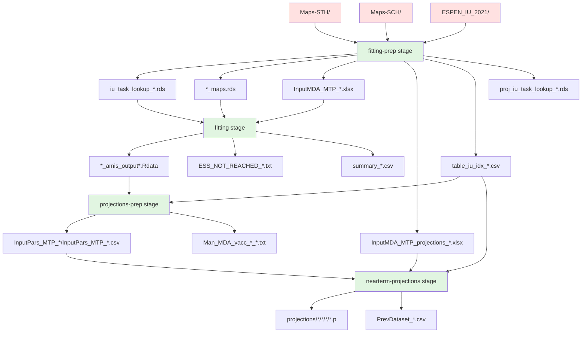

# STH/SCH AMIS Integration Pipeline - Docker Guide

This guide provides instructions for running the STH/SCH AMIS integration pipeline using Docker containers.

## Overview

The pipeline consists of four sequential stages:
1. **fitting-prep**: Prepares data for fitting (histories, maps, coverage files)
2. **fitting**: Runs AMIS fitting algorithm
3. **projections-prep**: Prepares data for projections
4. **nearterm-projections**: Runs projection simulations

## Supported Species

### STH (Soil-Transmitted Helminths)
- ascaris
- hookworm  
- trichuris

### SCH (Schistosomiasis)
- haematobium
- mansoni_low_burden
- mansoni_high_burden

## Prerequisites

1. Docker with BuildKit support
2. SSH access to private GitHub repositories (for building)
3. Sufficient disk space for input data and outputs (~10GB recommended)

## Building the Docker Image

```bash
DOCKER_BUILDKIT=1 docker build --ssh default=$SSH_AUTH_SOCK . -t sch-sth-amis-pipeline
```

## Basic Usage

### Running a Single Stage

```bash
docker run --rm \
  -v $(pwd)/fitting-prep/artefacts:/ntdmc/sth-sch-amis-integration/fitting-prep/artefacts \
  -v $(pwd)/fitting/artefacts:/ntdmc/sth-sch-amis-integration/fitting/artefacts \
  -v $(pwd)/projections-prep/artefacts:/ntdmc/sth-sch-amis-integration/projections-prep/artefacts \
  -v $(pwd)/projections/artefacts:/ntdmc/sth-sch-amis-integration/projections/artefacts \
  sch-sth-amis-pipeline \
  --stage=fitting --disease=sth --sth-species=ascaris --id=10
```

### Running the Full Pipeline

```bash
docker run --rm \
  -v $(pwd)/fitting-prep/artefacts:/ntdmc/sth-sch-amis-integration/fitting-prep/artefacts \
  -v $(pwd)/fitting/artefacts:/ntdmc/sth-sch-amis-integration/fitting/artefacts \
  -v $(pwd)/projections-prep/artefacts:/ntdmc/sth-sch-amis-integration/projections-prep/artefacts \
  -v $(pwd)/projections/artefacts:/ntdmc/sth-sch-amis-integration/projections/artefacts \
  sch-sth-amis-pipeline \
  --stage=all --disease=sth --sth-species=ascaris --id=10
```

## Command-Line Parameters

### Required Parameters

- `--stage`: Pipeline stage to run
  - `fitting-prep`: Data preparation stage
  - `fitting`: AMIS fitting stage
  - `projections-prep`: Projection preparation stage
  - `nearterm-projections`: Run projections
  - `all`: Run complete pipeline

- `--disease`: Disease type
  - `sth`: Soil-transmitted helminths
  - `sch`: Schistosomiasis

### Species Selection

For STH:
- `--sth-species`: Comma-separated list or individual species
  - Options: `ascaris`, `hookworm`, `trichuris`, `all`
  - Example: `--sth-species=ascaris,hookworm`

For SCH:
- `--sch-species`: Comma-separated list or individual species
  - Options: `haematobium`, `mansoni_low_burden`, `mansoni_high_burden`, `all`
  - Example: `--sch-species=haematobium`

### Batch Processing

- `--id`: Batch/Task ID to process (required for fitting and projections stages)
  - Example: `--id=10`

### AMIS Parameters (Fitting Stage)

- `--amis-sigma`: Sigma parameter for AMIS (default: 0.0025)
- `--amis-n-samples`: Number of samples per iteration (default: 1000 for STH, 500 for SCH)
- `--amis-target-ess`: Target effective sample size (default: 500)
- `--amis-n-iters`: Maximum iterations (default: 50)
- `--num-cores`: Number of CPU cores to use (default: auto-detect)

For development/testing, use smaller values:
```bash
--amis-n-samples=10 --amis-n-iters=10 --amis-target-ess=1 --num-cores=2
```

### Projection Parameters

- `--ess-threshold`: ESS threshold for projection prep (default: 10)
- `--failed-ids`: Comma-separated list of failed batch IDs

## Examples

### STH Pipeline Examples

#### Run fitting-prep for all STH species
```bash
docker run --rm \
  -v $(pwd)/fitting-prep/artefacts:/ntdmc/sth-sch-amis-integration/fitting-prep/artefacts \
  sch-sth-amis-pipeline \
  --stage=fitting-prep --disease=sth --id=10
```

#### Run fitting for trichuris with development parameters
```bash
docker run --rm \
  -v $(pwd)/fitting-prep/artefacts:/ntdmc/sth-sch-amis-integration/fitting-prep/artefacts \
  -v $(pwd)/fitting/artefacts:/ntdmc/sth-sch-amis-integration/fitting/artefacts \
  sch-sth-amis-pipeline \
  --stage=fitting --disease=sth --sth-species=trichuris \
  --id=10 --amis-n-samples=10 --amis-target-ess=1 --num-cores=4
```

#### Run complete pipeline for ascaris
```bash
docker run --rm \
  -v $(pwd)/fitting-prep/artefacts:/ntdmc/sth-sch-amis-integration/fitting-prep/artefacts \
  -v $(pwd)/fitting/artefacts:/ntdmc/sth-sch-amis-integration/fitting/artefacts \
  -v $(pwd)/projections-prep/artefacts:/ntdmc/sth-sch-amis-integration/projections-prep/artefacts \
  -v $(pwd)/projections/artefacts:/ntdmc/sth-sch-amis-integration/projections/artefacts \
  sch-sth-amis-pipeline \
  --stage=all --disease=sth --sth-species=ascaris \
  --id=10 --amis-n-samples=100 --amis-target-ess=50
```

### SCH Pipeline Examples

#### Run fitting-prep for SCH haematobium
```bash
docker run --rm \
  -v $(pwd)/fitting-prep/artefacts:/ntdmc/sth-sch-amis-integration/fitting-prep/artefacts \
  sch-sth-amis-pipeline \
  --stage=fitting-prep --disease=sch --sch-species=haematobium --id=10
```

#### Run fitting for mansoni low burden variant
```bash
docker run --rm \
  -v $(pwd)/fitting-prep/artefacts:/ntdmc/sth-sch-amis-integration/fitting-prep/artefacts \
  -v $(pwd)/fitting/artefacts:/ntdmc/sth-sch-amis-integration/fitting/artefacts \
  sch-sth-amis-pipeline \
  --stage=fitting --disease=sch --sch-species=mansoni_low_burden \
  --id=10 --amis-n-samples=50 --amis-target-ess=10
```

#### Run projections for SCH haematobium
```bash
docker run --rm \
  -v $(pwd)/fitting-prep/artefacts:/ntdmc/sth-sch-amis-integration/fitting-prep/artefacts \
  -v $(pwd)/projections-prep/artefacts:/ntdmc/sth-sch-amis-integration/projections-prep/artefacts \
  -v $(pwd)/projections/artefacts:/ntdmc/sth-sch-amis-integration/projections/artefacts \
  sch-sth-amis-pipeline \
  --stage=nearterm-projections --disease=sch --sch-species=haematobium \
  --id=10 --num-cores=8
```

## Volume Mounts

The pipeline requires specific directories to be mounted:

| Mount Path | Purpose | Required For |
|------------|---------|--------------|
| `/fitting-prep/artefacts` | Input data and prepared files | All stages |
| `/fitting/artefacts` | AMIS fitting outputs | fitting, projections-prep, nearterm-projections |
| `/projections-prep/artefacts` | Projection prep outputs | projections-prep, nearterm-projections |
| `/projections/artefacts` | Projection results | nearterm-projections |

## Output Files

### Fitting-Prep Stage
- `endgame_inputs/STH/InputMDA_MTP_{id}.xlsx` - Coverage files for fitting
- `endgame_inputs/STH/InputMDA_MTP_projections_{iu}.xlsx` - Coverage files for projections
- `Maps/iu_task_lookup_{species}.rds` - Batch-IU mapping files
- `Maps/{species}_maps.rds` - Map data for each species

### Fitting Stage
- `fit_amis_{species}_{id}_sigma{value}.RData` - AMIS fitting results
- `summary_{species}.csv` - Summary statistics

### Projections-Prep Stage
- `InputPars_MTP_{species}/InputPars_MTP_{iu}.csv` - Parameter files
- `Man_MDA_vacc/Man_MDA_vacc_{species}_{iu}.txt` - Coverage text files

### Nearterm-Projections Stage
- `projections/{species}/{country}/{country}{iu}/{Species}_{country}{iu}.p` - Projection pickle files
- `projections/{species}/{country}/{country}{iu}/PrevDataset_{Species}_{country}{iu}.csv` - Prevalence data

## Performance Considerations

### Development Parameters
For quick testing and development:
```bash
--amis-n-samples=10 --amis-n-iters=10 --amis-target-ess=1 --ess-threshold=1 --num-cores=2
```

### Production Parameters
For production runs:
```bash
--amis-n-samples=1000 --amis-n-iters=50 --amis-target-ess=500 --ess-threshold=10 --num-cores=8
```

### Expected Runtimes
With development parameters on 8 cores:
- STH species: 5-12 minutes per batch
- SCH species: 10-20 minutes per batch

With production parameters:
- STH species: 30-60 minutes per batch
- SCH species: 60-120 minutes per batch

## Troubleshooting

### Common Issues

1. **"File not found" errors**: Ensure all required volume mounts are specified
2. **Memory issues**: SCH haematobium is memory-intensive. Increase Docker memory allocation if needed
3. **"Killed" errors**: Usually indicates out-of-memory. Reduce `--num-cores` or increase Docker resources
4. **Missing lookup files**: Run fitting-prep stage first to generate required lookup files

### Debug Mode

To see detailed output, run Docker without the `--rm` flag and check logs:
```bash
docker run --name debug-run \
  -v $(pwd)/fitting-prep/artefacts:/ntdmc/sth-sch-amis-integration/fitting-prep/artefacts \
  sch-sth-amis-pipeline \
  --stage=fitting-prep --disease=sth --id=10

# Check logs
docker logs debug-run

# Clean up
docker rm debug-run
```

## Cloud Deployment

The pipeline supports artifact-based deployment for cloud environments:

1. Run fitting-prep locally or in CI/CD
2. Upload artefacts to cloud storage
3. Download artefacts in cloud compute instances
4. Run fitting and projection stages in parallel across multiple instances

Example workflow:
```bash
# Local: Generate artifacts
docker run --rm -v $(pwd)/fitting-prep/artefacts:/ntdmc/sth-sch-amis-integration/fitting-prep/artefacts \
  sch-sth-amis-pipeline --stage=fitting-prep --disease=sth --id=10

# Upload to cloud storage (example with AWS S3)
aws s3 sync fitting-prep/artefacts s3://bucket/fitting-prep-artefacts/

# Cloud instance: Download and run fitting
aws s3 sync s3://bucket/fitting-prep-artefacts/ fitting-prep/artefacts/
docker run --rm -v $(pwd):/ntdmc/sth-sch-amis-integration \
  sch-sth-amis-pipeline --stage=fitting --disease=sth --sth-species=ascaris --id=10
```

## Pipeline Dependency Graph

### Stage Dependencies and Data Flow



### Detailed File Dependencies by Stage

#### Stage 1: Fitting-Prep
**Inputs:**
- `Maps-STH/` (embedded in Docker image)
- `Maps-SCH/` (embedded in Docker image) 
- `ESPEN_IU_2021/` (embedded in Docker image)

**Outputs:**
- `Maps/iu_task_lookup_{species}.rds` - Batch-to-IU mapping
  - STH: `iu_task_lookup_sth.rds`, `iu_task_lookup_trichuris.rds`
  - SCH: `iu_task_lookup_haema.rds`, `iu_task_lookup_mansoni_{variant}.rds`
- `Maps/{species}_maps.rds` - Processed map data
- `Maps/table_iu_idx_{species}.csv` - IU index tables
- `Maps/proj_iu_task_lookup_{species}.rds` - Projection batch mapping
- `endgame_inputs/{dir}/InputMDA_MTP_{id}.xlsx` - Coverage files for fitting
- `endgame_inputs/{dir}/InputMDA_MTP_projections_{iu}.xlsx` - Coverage files for projections

#### Stage 2: Fitting
**Inputs:**
- `Maps/iu_task_lookup_{species}.rds` (from fitting-prep)
- `Maps/{species}_maps.rds` (from fitting-prep)
- `endgame_inputs/{dir}/InputMDA_MTP_{id}.xlsx` (from fitting-prep)

**Outputs:**
- `AMIS_output/{species}_amis_output{id}.Rdata` (when sigma=0.0025, default)
- `AMIS_output/{species}_amis_output{id}_sigma{value}.Rdata` (when sigma≠0.0025)
- `ESS_NOT_REACHED_{species}.txt` - Failed IUs list
- `summary_{species}.csv` - Summary statistics

#### Stage 3: Projections-Prep
**Inputs:**
- `AMIS_output/{species}_amis_output{id}{sigma_suffix}.Rdata` (from fitting)
- `Maps/table_iu_idx_{species}.csv` (from fitting-prep)

**Outputs:**
- `InputPars_MTP_{species}/InputPars_MTP_{iu}.csv` - Sampled parameters
- `Man_MDA_vacc/Man_MDA_vacc_{species}_{iu}.txt` - Coverage text files

#### Stage 4: Nearterm-Projections
**Inputs:**
- `InputPars_MTP_{species}/InputPars_MTP_{iu}.csv` (from projections-prep)
- `endgame_inputs/{dir}/InputMDA_MTP_projections_{iu}.xlsx` (from fitting-prep)
- `Maps/table_iu_idx_{species}.csv` (from fitting-prep)

**Outputs:**
- `projections/{species}/{country}/{country}{iu}/{Species}_{country}{iu}.p` - Pickle files
- `projections/{species}/{country}/{country}{iu}/PrevDataset_{Species}_{country}{iu}.csv` - Prevalence data

### Cross-Stage Dependencies

Several artifacts from fitting-prep are needed by multiple downstream stages:

1. **`table_iu_idx_{species}.csv`**: Used by both projections-prep and nearterm-projections
2. **`InputMDA_MTP_projections_{iu}.xlsx`**: Generated in fitting-prep but only used in nearterm-projections
3. **AMIS output files**: The sigma suffix handling is critical - files without suffix are from sigma=0.0025, files with suffix use that specific sigma value

### File Naming Conventions

#### Sigma Suffix Rules
- Default sigma (0.0025): No suffix → `{species}_amis_output{id}.Rdata`
- Non-default sigma: With suffix → `{species}_amis_output{id}_sigma{value}.Rdata`

#### Species Directory Mapping
- STH: All species use `endgame_inputs/STH/`
- SCH haematobium: Uses `endgame_inputs/sch-haematobium/`
- SCH mansoni: Uses `endgame_inputs/sch-mansoni/`

## Important Notes

### General Pipeline Notes
- The pipeline uses consistent TaskID mapping across all stages
- Batch IDs from fitting stage are preserved through projection stages
- Input data files are embedded in the Docker image for Maps-STH and Maps-SCH
- The Docker image uses the `updateImportation` branch of `ntd-model-sch` (note: `run-amis-fitting` branch has file path bugs)

### Species-Specific Considerations

#### STH Species
- Trichuris uses ALB+IVM drug regimen (different from ALB/MBD for ascaris/hookworm)
- Default AMIS parameters: 1000 samples per iteration

#### SCH Species
- Default AMIS parameters: 500 samples per iteration (half of STH)
- **Importation**: Currently set to 0 for all SCH species. If importation is needed for your analysis, the parameter files in `ntd-model-sch/sch_simulation/data/SCH_params/` need to be updated with appropriate importation rates

#### SCH Mansoni Variant Selection
The pipeline currently treats `mansoni_low_burden` and `mansoni_high_burden` as independent species. For more sophisticated analysis:

**Current Implementation**: Choose either low_burden OR high_burden variant upfront
```bash
--sch-species=mansoni_low_burden  # OR
--sch-species=mansoni_high_burden
```

**Advanced Workflow** (not automated, requires manual post-processing):
1. Run BOTH variants for all IUs in the batch
2. Compare model evidence or ESS between variants for each IU
3. Select the best-fitting variant per IU
4. Use the selected variant for projections

This advanced workflow would require:
- Running fitting twice (once for each variant)
- Post-processing script to compare results and create selection file
- Modified projection stage to use the selection file

### Handling Failed Batches and Low ESS

The pipeline provides flexibility for handling batches that fail or have low ESS:

#### Using Different Sigma Values
If a batch fails or has low ESS with default sigma (0.0025), simply rerun with a higher value:
```bash
# First attempt with default sigma
--stage=fitting --id=10 --amis-sigma=0.0025

# If failed or low ESS, retry with higher sigma
--stage=fitting --id=10 --amis-sigma=0.025
```

#### Identifying Low ESS Batches
A utility script `fitting/scripts/find_lowESS_ids.R` can identify batches with ESS below threshold. This Docker-compatible command-line tool:
- Loads AMIS output files and calculates ESS for each IU
- Reports batch IDs with insufficient ESS
- Provides detailed breakdown by batch and recommended actions
- Supports all STH and SCH species with configurable parameters

**Using the script within the Docker pipeline:**
```bash
# Basic usage - analyze all batches for ascaris with default ESS threshold (200)
docker run --rm \
  -v $(pwd)/fitting-prep/artefacts:/ntdmc/sth-sch-amis-integration/fitting-prep/artefacts \
  -v $(pwd)/fitting/artefacts:/ntdmc/sth-sch-amis-integration/fitting/artefacts \
  --entrypoint Rscript \
  sch-sth-amis-pipeline \
  fitting/scripts/find_lowESS_ids.R --species=ascaris

# Advanced usage - exclude known failed batches and use custom ESS threshold
docker run --rm \
  -v $(pwd)/fitting-prep/artefacts:/ntdmc/sth-sch-amis-integration/fitting-prep/artefacts \
  -v $(pwd)/fitting/artefacts:/ntdmc/sth-sch-amis-integration/fitting/artefacts \
  --entrypoint Rscript \
  sch-sth-amis-pipeline \
  fitting/scripts/find_lowESS_ids.R --species=ascaris --ess-threshold=250 --failed-ids=10,25,67

# For batches that were rerun with higher sigma
docker run --rm \
  -v $(pwd)/fitting-prep/artefacts:/ntdmc/sth-sch-amis-integration/fitting-prep/artefacts \
  -v $(pwd)/fitting/artefacts:/ntdmc/sth-sch-amis-integration/fitting/artefacts \
  --entrypoint Rscript \
  sch-sth-amis-pipeline \
  fitting/scripts/find_lowESS_ids.R --species=ascaris --sigma=0.025 --failed-ids=10,25,67
```

**Script Parameters:**
- `--species`: Species to analyze (ascaris, hookworm, trichuris, haematobium, mansoni_low_burden, mansoni_high_burden)
- `--ess-threshold`: ESS threshold below which batches are flagged (default: 200)
- `--failed-ids`: Comma-separated list of batch IDs that completely failed (default: none)
- `--sigma`: Sigma value for AMIS output files (default: 0.0025)

**Example Output:**
```
=== ESS ANALYSIS RESULTS ===
Total IUs analyzed: 1247
IUs with ESS < 200: 89 (7.1%)
Batches with insufficient ESS: 12

BATCHES TO RERUN WITH HIGHER SIGMA:
15,23,42,58,67,89,103,117,134,156,178,199

DETAILED BREAKDOWN:
Batch 15: 3 IUs with low ESS (min: 45.2, max: 178.9, avg: 112.4)
Batch 23: 5 IUs with low ESS (min: 23.1, max: 195.4, avg: 98.7)
...

RECOMMENDED ACTION:
Rerun fitting for the flagged batches with higher sigma (e.g., 0.025):
--stage=fitting --id=15 --id=23 --id=42 --amis-sigma=0.025
```

#### Stage-by-Stage Execution
The pipeline supports running individual stages, allowing you to:
- Run fitting with different parameters without re-running fitting-prep
- Run projections using fitting artifacts from different model versions
- Mix and match artifacts from different runs

Example workflow:
```bash
# Day 1: Run fitting with one model version
docker run --rm -v ... sch-sth-amis-pipeline --stage=fitting --id=10

# Day 7: Run projections with same fitting artifacts but updated projection model
docker run --rm -v ... sch-sth-amis-pipeline --stage=nearterm-projections --id=10
```

This flexibility allows for iterative refinement and debugging without re-running the entire pipeline.

### Dependency Validation

The pipeline validates that required artifacts exist before running each stage. If dependencies are missing, it provides helpful feedback:

```bash
# Example: Running nearterm-projections without prerequisites
docker run --rm -v ... sch-sth-amis-pipeline --stage=nearterm-projections --id=10

# Output:
❌ Dependencies not satisfied for stage: nearterm-projections
   Missing dependencies:
   - STH IU lookup table for projections
   - Projection parameters for ascaris
💡 Try running: --stage=fitting-prep or --stage=projections-prep --id=10
```

**Current Behavior**: The pipeline validates dependencies and reports missing artifacts, but does NOT automatically run prerequisite stages. Users must manually run the required stages based on the feedback.

**Manual Dependency Resolution**:
1. Check the error message to identify missing dependencies
2. Run the suggested prerequisite stages
3. Retry the original command

Example:
```bash
# Step 1: Attempt to run projections
docker run --rm -v ... sch-sth-amis-pipeline --stage=nearterm-projections --id=10
# Error: Missing dependencies from fitting-prep and projections-prep

# Step 2: Run prerequisite stages
docker run --rm -v ... sch-sth-amis-pipeline --stage=fitting-prep --id=10
docker run --rm -v ... sch-sth-amis-pipeline --stage=fitting --id=10  
docker run --rm -v ... sch-sth-amis-pipeline --stage=projections-prep --id=10

# Step 3: Now run projections
docker run --rm -v ... sch-sth-amis-pipeline --stage=nearterm-projections --id=10
```

**Future Enhancement**: A potential improvement would be to add automatic dependency resolution, where specifying a later stage would automatically run all prerequisite stages if their artifacts are missing. This would work similar to a `make` build system. For now, users can achieve the same result by using `--stage=all` or manually running stages in sequence based on the validation feedback.