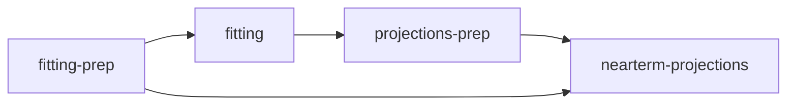

# STH/SCH AMIS Pipeline

## 🚀 Quick Start

### Build Docker Image
```bash
DOCKER_BUILDKIT=1 docker build --ssh default=$SSH_AUTH_SOCK . -t sch-sth-amis-pipeline
```

### Scenario 1: Skip Fitting-Prep (Use Pre-built Artifacts)
**Most Common**: Use embedded fitting-prep artifacts, run fitting→projections-prep→nearterm-projections

```bash
# STH - Complete pipeline from fitting onwards
docker run --rm \
  -v $(pwd)/fitting/artefacts:/ntdmc/sth-sch-amis-integration/fitting/artefacts \
  -v $(pwd)/projections-prep/artefacts:/ntdmc/sth-sch-amis-integration/projections-prep/artefacts \
  -v $(pwd)/projections/artefacts:/ntdmc/sth-sch-amis-integration/projections/artefacts \
  sch-sth-amis-pipeline \
  --stage=skip-fitting-prep --disease=sth --sth-species=ascaris --id=10 --num-cores=8

# SCH - Complete pipeline from fitting onwards  
docker run --rm \
  -v $(pwd)/fitting/artefacts:/ntdmc/sth-sch-amis-integration/fitting/artefacts \
  -v $(pwd)/projections-prep/artefacts:/ntdmc/sth-sch-amis-integration/projections-prep/artefacts \
  -v $(pwd)/projections/artefacts:/ntdmc/sth-sch-amis-integration/projections/artefacts \
  sch-sth-amis-pipeline \
  --stage=skip-fitting-prep --disease=sch --sch-species=haematobium --id=10 --num-cores=8
```

### Scenario 2: Fitting Only (Distributed Batch Processing)
**Cloud Deployment**: Run only fitting stage with pre-built artifacts

```bash
# STH Fitting - Production parameters
docker run --rm \
  -v $(pwd)/fitting/artefacts:/ntdmc/sth-sch-amis-integration/fitting/artefacts \
  sch-sth-amis-pipeline \
  --stage=fitting --disease=sth --sth-species=ascaris --id=10 \
  --amis-n-samples=1000 --amis-n-iters=50 --num-cores=8

# SCH Fitting - Production parameters  
docker run --rm \
  -v $(pwd)/fitting/artefacts:/ntdmc/sth-sch-amis-integration/fitting/artefacts \
  sch-sth-amis-pipeline \
  --stage=fitting --disease=sch --sch-species=haematobium --id=10 \
  --amis-n-samples=500 --amis-n-iters=50 --num-cores=8
```

### Scenario 3: Nearterm-Projections Only
**Post-Processing**: Run projections with existing fitting results

```bash
# STH Projections
docker run --rm \
  -v $(pwd)/projections-prep/artefacts:/ntdmc/sth-sch-amis-integration/projections-prep/artefacts \
  -v $(pwd)/projections/artefacts:/ntdmc/sth-sch-amis-integration/projections/artefacts \
  sch-sth-amis-pipeline \
  --stage=nearterm-projections --disease=sth --sth-species=ascaris --id=10 --num-cores=8

# SCH Projections
docker run --rm \
  -v $(pwd)/projections-prep/artefacts:/ntdmc/sth-sch-amis-integration/projections-prep/artefacts \
  -v $(pwd)/projections/artefacts:/ntdmc/sth-sch-amis-integration/projections/artefacts \
  sch-sth-amis-pipeline \
  --stage=nearterm-projections --disease=sch --sch-species=haematobium --id=10 --num-cores=8
```

## 🚀 Complete Stage Reference

### Stage 1: Fitting-Prep (Run Once Per Species) 
*Only needed if creating custom artifacts*

```bash
# STH - creates data for all batches
docker run --rm \
  -v $(pwd)/fitting-prep/artefacts:/ntdmc/sth-sch-amis-integration/fitting-prep/artefacts \
  sch-sth-amis-pipeline \
  --stage=fitting-prep --disease=sth

# SCH - creates data for all batches  
docker run --rm \
  -v $(pwd)/fitting-prep/artefacts:/ntdmc/sth-sch-amis-integration/fitting-prep/artefacts \
  sch-sth-amis-pipeline \
  --stage=fitting-prep --disease=sch --sch-species=haematobium
```

### Stage 2: Fitting (Run Per Batch)
```bash
# STH
docker run --rm \
  -v $(pwd)/fitting-prep/artefacts:/ntdmc/sth-sch-amis-integration/fitting-prep/artefacts \
  -v $(pwd)/fitting/artefacts:/ntdmc/sth-sch-amis-integration/fitting/artefacts \
  sch-sth-amis-pipeline \
  --stage=fitting --disease=sth --sth-species=ascaris --id=10 \
  --amis-n-samples=1000 --amis-n-iters=50 --num-cores=8

# SCH
docker run --rm \
  -v $(pwd)/fitting-prep/artefacts:/ntdmc/sth-sch-amis-integration/fitting-prep/artefacts \
  -v $(pwd)/fitting/artefacts:/ntdmc/sth-sch-amis-integration/fitting/artefacts \
  sch-sth-amis-pipeline \
  --stage=fitting --disease=sch --sch-species=haematobium --id=10 \
  --amis-n-samples=500 --amis-n-iters=50 --num-cores=8
```

### Stage 3: Projections-Prep (Run Per Batch)
```bash
# STH
docker run --rm \
  -v $(pwd)/fitting-prep/artefacts:/ntdmc/sth-sch-amis-integration/fitting-prep/artefacts \
  -v $(pwd)/fitting/artefacts:/ntdmc/sth-sch-amis-integration/fitting/artefacts \
  -v $(pwd)/projections-prep/artefacts:/ntdmc/sth-sch-amis-integration/projections-prep/artefacts \
  sch-sth-amis-pipeline \
  --stage=projections-prep --disease=sth --sth-species=ascaris --id=10

# SCH  
docker run --rm \
  -v $(pwd)/fitting-prep/artefacts:/ntdmc/sth-sch-amis-integration/fitting-prep/artefacts \
  -v $(pwd)/fitting/artefacts:/ntdmc/sth-sch-amis-integration/fitting/artefacts \
  -v $(pwd)/projections-prep/artefacts:/ntdmc/sth-sch-amis-integration/projections-prep/artefacts \
  sch-sth-amis-pipeline \
  --stage=projections-prep --disease=sch --sch-species=haematobium --id=10
```

### Stage 4: Near-term Projections (Run Per Batch)
```bash
# STH
docker run --rm \
  -v $(pwd)/fitting-prep/artefacts:/ntdmc/sth-sch-amis-integration/fitting-prep/artefacts \
  -v $(pwd)/projections-prep/artefacts:/ntdmc/sth-sch-amis-integration/projections-prep/artefacts \
  -v $(pwd)/projections/artefacts:/ntdmc/sth-sch-amis-integration/projections/artefacts \
  sch-sth-amis-pipeline \
  --stage=nearterm-projections --disease=sth --sth-species=ascaris --id=10 --num-cores=8

# SCH
docker run --rm \
  -v $(pwd)/fitting-prep/artefacts:/ntdmc/sth-sch-amis-integration/fitting-prep/artefacts \
  -v $(pwd)/projections-prep/artefacts:/ntdmc/sth-sch-amis-integration/projections-prep/artefacts \
  -v $(pwd)/projections/artefacts:/ntdmc/sth-sch-amis-integration/projections/artefacts \
  sch-sth-amis-pipeline \
  --stage=nearterm-projections --disease=sch --sch-species=haematobium --id=10 --num-cores=8
```

## 📁 Expected Output Files

### After Fitting Stage
```
fitting/artefacts/AMIS_output/{species}_amis_output{id}.Rdata
```
**Location**: `fitting/artefacts/AMIS_output/`
**Examples**: `ascaris_amis_output10.Rdata`, `haematobium_amis_output25.Rdata`

### After Projections-Prep Stage  
```
projections-prep/artefacts/InputPars_MTP_{species}/InputPars_MTP_{iu}.csv
```
**Location**: `projections-prep/artefacts/InputPars_MTP_{species}/`
**Examples**: `InputPars_MTP_ascaris/InputPars_MTP_12345.csv`

### After Near-term Projections Stage
```
projections/artefacts/projections/{species}/{country}/{country}{iu}/{Species}_{country}{iu}.p
```
**Location**: `projections/artefacts/projections/{species}/{country}/{country}{iu}/`
**Examples**: `projections/ascaris/TZA/TZA12345/Asc_TZA12345.p`

## 🔧 Key Parameters for Cloud Deployment

| Parameter | STH Production | SCH Production | Purpose |
|-----------|---------------|----------------|---------|
| `--id` | `10,11,12...` | `10,11,12...` | Batch ID |
| `--amis-n-samples` | `1000` | `500` | AMIS samples per iteration |
| `--amis-n-iters` | `50` | `50` | Maximum AMIS iterations |
| `--num-cores` | `8-16` | `8-16` | CPU cores (match instance) |
| `--ess-threshold` | `200` | `200` | ESS threshold for file selection |

## 🔄 Two-Stage Fitting Workflow

**Important**: If fitting shows low ESS, you need a second run with higher sigma.

### 1. Check Fitting Results
After fitting, check the manifest:
```
📋 FITTING MANIFEST - Batch 10
🔬 ASCARIS
   📊 ESS: 1 IUs, min: 4.8 max: 4.8 mean: 4.8 below_threshold: 1
   ⚠️  1 IUs with ESS < 200 - consider --amis-sigma=0.025
```

### 2. Rerun Low-ESS Batches
```bash
# Rerun with higher sigma for better convergence
docker run --rm \
  -v $(pwd)/fitting-prep/artefacts:/ntdmc/sth-sch-amis-integration/fitting-prep/artefacts \
  -v $(pwd)/fitting/artefacts:/ntdmc/sth-sch-amis-integration/fitting/artefacts \
  sch-sth-amis-pipeline \
  --stage=fitting --disease=sth --sth-species=ascaris --id=10 --amis-sigma=0.025
```

This creates: `ascaris_amis_output10_sigma0.025.Rdata`

**Note**: Projections-prep will automatically use the sigma file for low-ESS IUs.

## 🚨 Common Issues

### 1. Projections-prep fails: "cannot open compressed file"
**Error**: `Error: cannot open compressed file 'ascaris_amis_output10_sigma0.0025.Rdata'`
**Fix**: Rerun fitting with `--amis-sigma=0.025` OR use `--ess-threshold=1` for testing

### 2. Missing files
**Error**: Various file not found errors
**Fix**: Ensure all volume mounts are specified and fitting-prep was run

## 🗂️ Supported Species

### STH (Soil-Transmitted Helminths)
- `ascaris` - Ascaris lumbricoides
- `hookworm` - Necator americanus/Ancylostoma duodenale  
- `trichuris` - Trichuris trichiura

### SCH (Schistosomiasis)
- `haematobium` - Schistosoma haematobium
- `mansoni_low_burden` - S. mansoni (low burden areas)
- `mansoni_high_burden` - S. mansoni (high burden areas)

---

# 📖 Detailed Reference

## Pipeline Overview

The pipeline consists of four sequential stages:
1. **fitting-prep**: Prepares data for fitting (run once per species)
2. **fitting**: Runs AMIS fitting algorithm (run per batch) 
3. **projections-prep**: Prepares data for projections (run per batch)
4. **nearterm-projections**: Runs projection simulations (run per batch)

## Volume Mount Requirements

| Mount Path | Purpose | Required For |
|------------|---------|--------------|
| `/fitting-prep/artefacts` | Input data and prepared files | All stages |
| `/fitting/artefacts` | AMIS fitting outputs | fitting, projections-prep, nearterm-projections |
| `/projections-prep/artefacts` | Projection prep outputs | projections-prep, nearterm-projections |
| `/projections/artefacts` | Final projection results | nearterm-projections |

## Complete Parameter Reference

### Required Parameters
- `--stage`: `fitting-prep`, `fitting`, `projections-prep`, `nearterm-projections`, `all`
- `--disease`: `sth` or `sch`
- `--id`: Batch ID (required for fitting, projections-prep, nearterm-projections)

### Species Selection
- `--sth-species`: `ascaris`, `hookworm`, `trichuris`, `all`
- `--sch-species`: `haematobium`, `mansoni_low_burden`, `mansoni_high_burden`, `all`

### AMIS Parameters (Fitting Stage)
- `--amis-sigma`: Sigma parameter (default: 0.0025, use 0.025 for reruns)
- `--amis-n-samples`: Samples per iteration (default: 1000 STH, 500 SCH)
- `--amis-target-ess`: Target ESS (default: 500)
- `--amis-n-iters`: Max iterations (default: 50)
- `--num-cores`: CPU cores (default: auto-detect)

### Projection Parameters
- `--ess-threshold`: ESS threshold (default: 200)
- `--failed-ids`: Comma-separated failed batch IDs

## Development/Testing Parameters

For quick testing (not production):
```bash
--amis-n-samples=10 --amis-n-iters=10 --amis-target-ess=1 --ess-threshold=1 --num-cores=2
```

## File Naming Conventions

### AMIS Output Files
- Default sigma: `{species}_amis_output{id}.Rdata`
- Custom sigma: `{species}_amis_output{id}_sigma{value}.Rdata`

### Species Directory Structure
- **STH**: All species use `endgame_inputs/STH/`
- **SCH haematobium**: Uses `endgame_inputs/sch-haematobium/`
- **SCH mansoni**: Uses `endgame_inputs/sch-mansoni/`

## Pipeline Dependencies



**Cross-stage dependencies**:
- `nearterm-projections` needs files from both `fitting-prep` and `projections-prep`
- `projections-prep` intelligently selects AMIS files based on ESS thresholds

## ESS Analysis Script

Identify batches needing sigma reruns:
```bash
docker run --rm \
  -v $(pwd)/fitting-prep/artefacts:/ntdmc/sth-sch-amis-integration/fitting-prep/artefacts \
  -v $(pwd)/fitting/artefacts:/ntdmc/sth-sch-amis-integration/fitting/artefacts \
  --entrypoint Rscript \
  sch-sth-amis-pipeline \
  fitting/scripts/find_lowESS_ids.R --species=ascaris --ess-threshold=200
```

## Debug Mode

For troubleshooting:
```bash
docker run --name debug-run \
  -v $(pwd)/fitting-prep/artefacts:/ntdmc/sth-sch-amis-integration/fitting-prep/artefacts \
  sch-sth-amis-pipeline \
  --stage=fitting-prep --disease=sth --id=10

# Check logs
docker logs debug-run

# Clean up  
docker rm debug-run
```

## 🔧 Technical Notes

### SCH Parameter Files Workaround

**Issue**: The `run-amis-fitting` branch of `ntd-model-sch` is missing the `*_params_projections.txt` files required by SCH nearterm-projections stage.

**Solution**: During Docker build, we temporarily clone the `updateImportation` branch and copy the missing SCH projection parameter files:
- `haematobium_params_projections.txt`
- `mansoni_low_burden_params_projections.txt` 
- `mansoni_high_burden_params_projections.txt`

**Location in Dockerfile**:
```dockerfile
# WORKAROUND: Copy missing SCH projection parameter files from updateImportation branch
RUN mkdir -p /tmp/updateImportation
ADD --keep-git-dir git@github.com:NTD-Modelling-Consortium/ntd-model-sch.git#updateImportation /tmp/updateImportation
RUN cp -f /tmp/updateImportation/sch_simulation/data/SCH_params/*_params_projections.txt \
    ${STH_SCH_MODEL_DIR}/sch_simulation/data/SCH_params/ || echo "No projection parameter files found in updateImportation"
RUN rm -rf /tmp/updateImportation
```

**Future**: This workaround can be removed once the missing parameter files are added to the `run-amis-fitting` branch.
